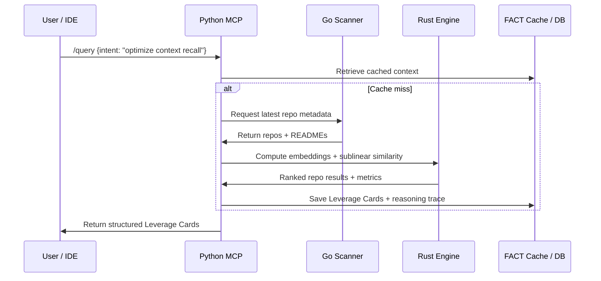

Excellent — here’s the **Technical Architecture Document (TAD)** for **RuvScan MCP (v0.4 hybrid)**.
This version is implementation-grade — you could hand it to a small dev team or begin scaffolding it in Cursor.

---

# 🧠 **Technical Architecture Document (TAD)**

## **RuvScan MCP – Sublinear Intelligence Scanner**

**Version:** 0.4
**Date:** October 2025
**Author:** Colm Byrne
**Languages:** 🐍 Python · 🦀 Rust · 🐹 Go
**Purpose:** Define the technical design and data flow for RuvScan — an MCP intelligence server that uses Ruvnet’s sublinear frameworks to perform conceptual scanning, reasoning, and discovery across GitHub.

---

## 1. 🧩 **Architecture Overview**

RuvScan is composed of **three cooperating runtime layers** orchestrated through **MCP (Model Context Protocol)** and **gRPC** channels.

```
User / Agent (IDE, CLI, TabStax)
      │
      ▼
🐍 Python MCP Orchestrator
(FastAPI + FACT + SAFLA)
      │
      ├── gRPC → 🦀 Rust Sublinear Engine
      │         (semantic comparison, clustering)
      │
      └── REST / MQ → 🐹 Go Scanning Workers
                (GitHub fetch, metadata diff, events)
```

---

## 2. ⚙️ **Component Summary**

| Component            | Language          | Description                                                                                                                                               |
| -------------------- | ----------------- | --------------------------------------------------------------------------------------------------------------------------------------------------------- |
| **MCP Orchestrator** | Python            | Main control plane. Exposes MCP endpoints, invokes reasoning, manages cache, and coordinates sublinear engine & scanner.                                  |
| **Sublinear Engine** | Rust              | High-performance library using `sublinear-time-solver` and `MidStream`. Performs vector comparisons, O(log n) clustering, and semantic distance analysis. |
| **Scanning Workers** | Go                | Distributed fetchers that query the GitHub API asynchronously, detect new repos/updates, and push data to the orchestrator via message queue or REST.     |
| **Storage**          | SQLite / Supabase | Persistent FACT cache (deterministic reasoning traces) + repo summaries, embeddings, and leverage cards.                                                  |

---

## 3. 🧠 **Data Flow Diagram**



---

## 4. 🧩 **Module Breakdown**

### 🐍 **Python MCP Orchestrator**

**Primary Responsibilities**

* Handle `/scan`, `/query`, `/compare`, and `/analyze` endpoints.
* Generate embeddings (OpenAI/Anthropic).
* Cache summaries via **FACT** (deterministic prompt replay).
* Perform analogical reasoning via **SAFLA/NOVA**.
* Orchestrate async communication with Go + Rust.

**Key Packages**

```bash
fastapi
pydantic
grpcio
sqlalchemy
supabase-py
openai
ruv-fact (custom wrapper)
```

**Internal Structure**

```
/mcp
 ├── server.py           # FastAPI entry point
 ├── endpoints/
 │    ├── scan.py        # Trigger scan, call Go workers
 │    ├── query.py       # Handle intent, call Rust
 │    ├── analyze.py     # Replay reasoning trace
 │    └── compare.py     # Sublinear repo similarity
 ├── reasoning/
 │    ├── fact_cache.py  # Deterministic context
 │    ├── sa fla_agent.py # Outside-box inference
 │    └── embeddings.py  # Embedding generator
 ├── bindings/
 │    ├── rust_client.py # gRPC to Rust engine
 │    ├── go_client.py   # REST to Go workers
 └── storage/
      ├── db.py
      └── models.py
```

---

### 🦀 **Rust Sublinear Engine**

**Purpose:**
Computational backbone of RuvScan — transforms embeddings into semantic graphs using **sublinear algorithms**.

**Core Libraries**

```toml
[dependencies]
sublinear-time-solver = "1.4.1"
midstream = "0.9.0"
tokio = { version = "1", features = ["full"] }
tonic = "0.11"   # gRPC server
serde = { version = "1.0", features = ["derive"] }
```

**Functions**

```rust
fn compute_similarity(vectors: Vec<Vector>) -> Vec<Match>;
fn cluster_embeddings(vectors: Vec<Vector>) -> Vec<Cluster>;
fn analyze_matrix(matrix: SparseMatrix) -> SublinearReport;
fn solve_true_sublinear(matrix: SparseMatrix, vector: Vec<f64>) -> Result;
```

**Exposed gRPC Services**

```proto
service Sublinear {
  rpc Compare (CompareRequest) returns (CompareResponse);
  rpc Analyze (MatrixRequest) returns (SublinearReport);
}
```

**Runtime Characteristics**

* TRUE O(log n) semantic comparison (Johnson–Lindenstrauss projection).
* WASM-accelerated fallback for portability.
* Streams results to Python via MidStream (async channel).

---

### 🐹 **Go Scanning Workers**

**Purpose:**
Concurrent GitHub scanners running as stateless microservices.

**Core Libraries**

```go
github.com/google/go-github/v57/github
golang.org/x/sync/errgroup
github.com/nats-io/nats.go // optional message bus
```

**Responsibilities**

* Fetch org/user/topic repos via GitHub GraphQL.
* Detect deltas (new or updated READMEs).
* Push JSON payloads to Python endpoint `/ingest`.
* Support webhook mode for near-real-time scanning.

**Structure**

```
/scanner
 ├── main.go
 ├── worker.go          # concurrent fetches
 ├── diff.go            # change detection
 ├── api_client.go      # GitHub GraphQL calls
 ├── publisher.go       # send to Python
 └── config.yaml
```

---

## 5. 🔗 **Inter-Service Communication**

| Channel           | From → To         | Protocol          | Payload                      |
| ----------------- | ----------------- | ----------------- | ---------------------------- |
| Query / Scan      | User → Python     | MCP / REST        | JSON                         |
| Repo Feed         | Go → Python       | REST POST /ingest | Repo metadata, README        |
| Semantic Analysis | Python → Rust     | gRPC              | Embeddings / matrix          |
| Stream Updates    | Rust → Python     | MidStream (async) | Partial similarity results   |
| Cache / Logs      | Python ↔ Supabase | REST / SQL        | Cards, reasoning, provenance |

**All data encoded as JSON with optional MsgPack compression.**

---

## 6. 🧠 **Leverage Card Pipeline**

1. **Fetch** — Go worker retrieves repo metadata + README.
2. **Summarize** — Python LLM creates structured JSON summary.
3. **Embed** — Python creates embedding vector (OpenAI or local).
4. **Compare** — Rust engine computes sublinear similarities.
5. **Infer** — SAFLA agent performs analogical reasoning.
6. **Cache** — FACT stores reasoning trace for determinism.
7. **Serve** — Python returns Leverage Cards to MCP client.

---

## 7. 📦 **Storage Schema (SQLite / Supabase)**

**Table: `repos`**
| id | name | org | description | topics | embedding | last_scan |

**Table: `leverage_cards`**
| id | repo_id | capabilities | summary | reasoning | integration_hint | score |

**Table: `fact_cache`**
| hash | prompt | response | version | timestamp |

All embeddings stored as sparse vectors; `sublinear_hash` field supports fast lookup in Rust engine.

---

## 8. ⚡ **Runtime & Performance Targets**

| Process               | Target      | Note                       |
| --------------------- | ----------- | -------------------------- |
| Full Scan (100 repos) | < 60 s      | Parallel Go workers        |
| Query Response        | < 2 s       | Cached + sublinear compute |
| Memory Footprint      | < 512 MB    | Shared WASM + streaming    |
| Throughput            | 100 req/min | MCP concurrent sessions    |
| Determinism           | 100 %       | FACT replay validation     |

---

## 9. 🔐 **Security & Observability**

* **Auth:** Personal Access Token (GitHub) + API key for MCP clients.
* **Logging:** Structured JSON logs via MidStream to Supabase.
* **Metrics:** Prometheus exporter (Go + Python).
* **Isolation:** Rust engine sandboxed via WASM runtime for safety.
* **Reproducibility:** All LLM reasoning cached with FACT hash chain.

---

## 10. 🧮 **Build & Deployment**

### Local Dev

```bash
# Run Go workers
go run ./scanner

# Run Rust engine
cargo run --bin ruvscan-sublinear

# Run MCP server
uvicorn mcp.server:app --reload
```

### Containerized

* Multi-stage Dockerfile:

  * Stage 1: build Rust binary
  * Stage 2: Go worker binary
  * Stage 3: Python runtime (FastAPI + bindings)
* All communicate internally via `docker-compose` network.

---

## 11. 🧩 **Integration Interfaces**

| Interface            | Consumer         | Example                                                   |
| -------------------- | ---------------- | --------------------------------------------------------- |
| **MCP Client (IDE)** | Cursor / TabStax | `/query "find performance frameworks for context recall"` |
| **CLI**              | Terminal         | `ruvscan query "AI orchestration tools"`                  |
| **API**              | Other agents     | `/scan?org=openai`                                        |
| **Internal**         | Rust gRPC        | `analyzeTrueSublinearMatrix()`                            |

---

## 12. 🧭 **Evolution Path**

| Version  | Change                                          | Goal                          |
| -------- | ----------------------------------------------- | ----------------------------- |
| **v0.5** | Replace SQLite with Supabase Realtime           | multi-agent sync              |
| **v0.6** | Add qudag-mcp trust signatures                  | federated RuvScan nodes       |
| **v0.7** | Port orchestrator to Rust fully                 | compiled deterministic engine |
| **v1.0** | Self-optimizing scanning (reinforcement tuning) | emergent meta-agent           |

---

## 13. 🧩 **Key Design Principles**

1. **Sublinear Core:** Every computation (semantic diff, clustering) runs in *O(log n)*.
2. **Deterministic Intelligence:** All reasoning is cached, replayable, and auditable.
3. **Distributed Elasticity:** Components can run locally or as independent nodes.
4. **Emergent Reasoning:** Uses SAFLA/NOVA for analogical pattern matching.
5. **Composable by Design:** MCP makes RuvScan a plug-in intelligence layer for any agent ecosystem.

---

**Summary:**
RuvScan is a **hybrid intelligence infrastructure** — Go crawls, Rust thinks, Python reasons.
Together, they form a living, sublinear cognitive mesh that continuously transforms open-source chaos into actionable, deterministic leverage.

---

Would you like me to produce the **initial code scaffolding** next (folder structure + stub files for Python FastAPI, Rust gRPC, and Go worker) so you can drop it straight into Cursor or Replit?

